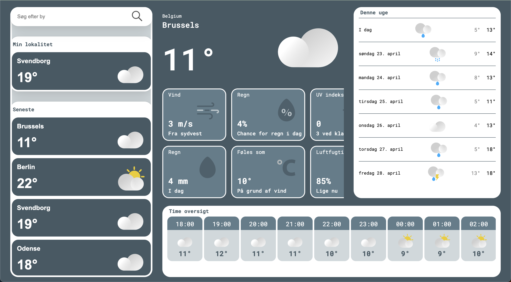
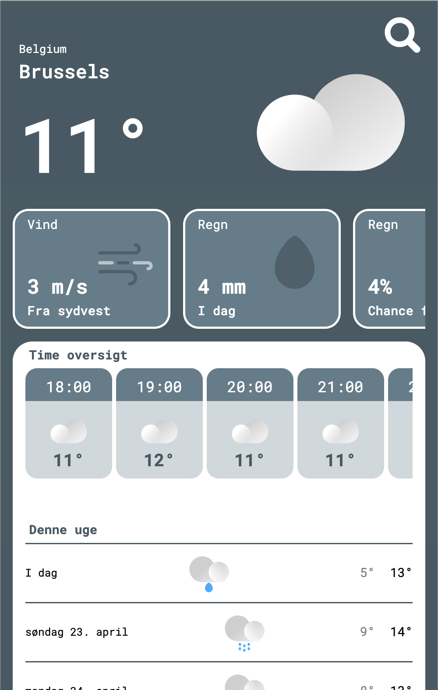

# The cloud cast

> This is a weather application build with svelte and vite.
> Live demo: [_here_](https://the-cloud-cast.web.app/). <!-- If you have the project hosted somewhere, include the link here. -->

## Table of Contents

- [General Info](#general-information)
- [Technologies Used](#technologies-used)
- [Apis Used](#Apis-Used)
- [Features](#features)
- [Screenshots](#screenshots)
- [Structure](#Structure)
- [Usage](#usage)
- [Project Status](#project-status)
- [Github and hosting](#Github-and-hosting)
- [Acknowledgements](#acknowledgements)
- [Contact](#contact)
<!-- * [License](#license) -->

## General Information

The Purpose of this project was to learn svelte, as well as learning about REST API's and system architecture on the web.
This Project was developed by:

- Project manager [_Kenni (me)_](https://github.com/kenn7575)
- Junior developer [_David_](https://github.com/davidsorensenn).

## Technologies Used

- Svelte
- NPM
- Vite
- JS
- Firebase hosting & analytics

## Apis Used

- [Open-Metro api](https://open-meteo.com/en/docs) for weather data
- [Geoapify api](https://www.geoapify.com/) for geo translation and location auto completion

## Features

This website features:

- Live weather updates
- Current, hourly and daily weather forecasts.
- Color scheme that changes after current weather.
- Last searched locations stored in local storage to provide quick weather for favourite locations.
- User location to display the weather for the users current location.
- A clean, and easily understandable UI that is fully responsive a course on screens.

## Screenshots

<!-- If you have screenshots you'd like to share, include them here. -->

## Setup

To setup and run this project localy, simply:

- Clone this repo in vs code.
- Run "npm install" in the terminal. (to setup and install dependencies.)
- Run "npm run dev" in the terminal. (to open a development server in your local browser.)

## Structure

All the code for the project is located in ".src/lib/".
The application is Divide into different folders:

- Components - This is all the front-end components. Some files may end with a capital letter. This indicates the level of nesting. Example: "someFile-C.svelte" would be Third in the chain.
- Views - This is a svelte media query that helps to make the app responsive. These are second in the component chain.
- Data - This is the entire back-end of the app. It includes API's, local storage, and svelte stores.
- Services - This is the logic of the application. It Contains a bunch of functions that is used from the UI/Components and it also communicate with the back-end/Data.

## Project Status

Project is: _in progress_.

## Github and hosting

This project:

- Is open source.
- Uses codeQL to analyse for errors and Threats on pull request and merge.
- Is automaticly deployed to firebase hosting on merge into "main" via actions.
- Is being deployed to a preview Channel on pull request to main. So features can be safly tested before merge.
- Require all security checks to pass on pull request before it can be merged into main.
- Has a issues tab. Feel free to create a new issue if you find bugs in the code, or fix it yourself😀.

## Contact

Created by [Kenni Kollemorten](https://kenni-kollemorten.dk/) and [David Sørensen](https://github.com/davidsorensenn) - feel free to contact me on [e-mail](mailto:info@kenni-kollemorten.dk)

<!-- Optional -->
<!-- ## License -->
<!-- This project is open source and available under the [... License](). -->

<!-- You don't have to include all sections - just the one's relevant to your project -->
